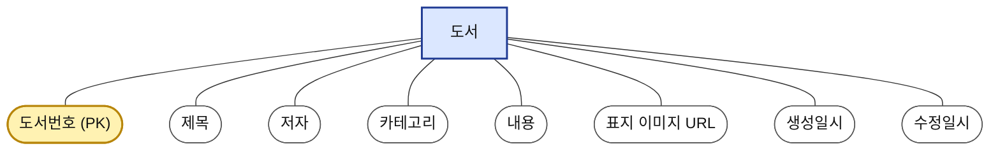
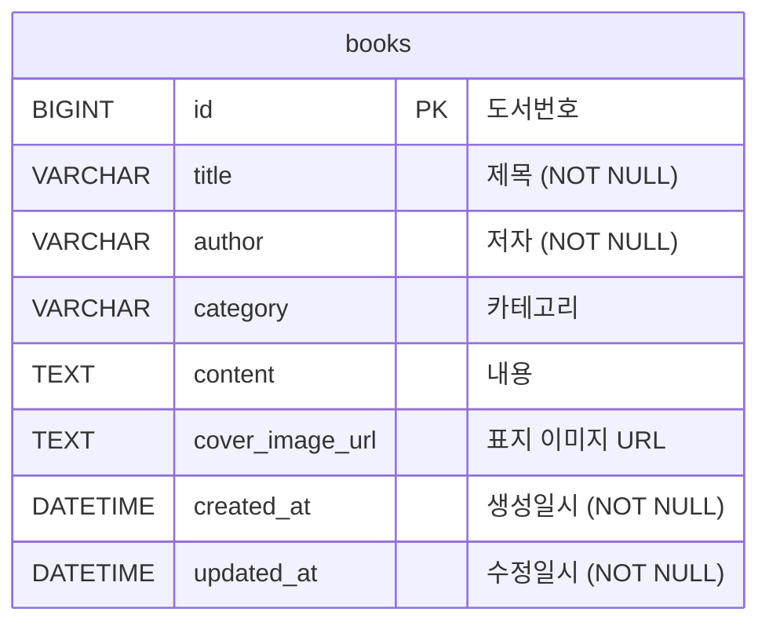

# 도서관리시스템 데이터 모델

엔티티: **`books` (Book)** — 단일 엔티티 (관계 없음)

---

## 1. ERD (개념 데이터 모델 · Chen 표기법)

> 실체(Entity) = 사각형, 속성(Attribute) = 타원, 식별자 = (PK)
> 본 프로젝트는 엔티티가 `도서` 하나뿐이라 관계(다이아몬드)는 표시되지 않습니다.

---

## 2. 논리 데이터 모델 (Crow's Foot · IE 표기법)

> 실체를 테이블로, 식별자를 PK로 표현합니다.
> 단일 테이블이라 외래키(FK)·관계선은 없습니다.

---

## 3. (참고) 테이블 명세서

| 속성(논리명) | 컬럼명(물리명) | 타입 | 길이 | NULL | 키 | 비고 |
|---|---|---|---|---|---|---|
| 도서 ID | `id` | BIGINT | - | NOT NULL | PK | AUTO_INCREMENT |
| 제목 | `title` | VARCHAR | 200 | NOT NULL | - | 필수 입력 |
| 저자 | `author` | VARCHAR | 100 | NOT NULL | - | 필수 입력 |
| 카테고리 | `category` | VARCHAR | 50 | NULL | - | 9종(소설/에세이 등) |
| 내용 | `content` | TEXT | - | NULL | - | AI 프롬프트 활용 |
| 표지 이미지 URL | `cover_image_url` | TEXT | - | NULL | - | Data URL(base64) |
| 생성일시 | `created_at` | DATETIME | - | NOT NULL | - | `@PrePersist` 자동 |
| 수정일시 | `updated_at` | DATETIME | - | NOT NULL | - | `@PreUpdate` 자동 |
